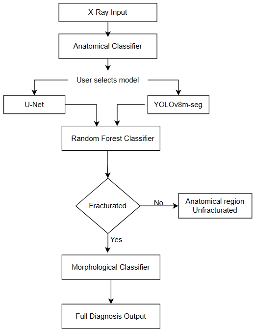
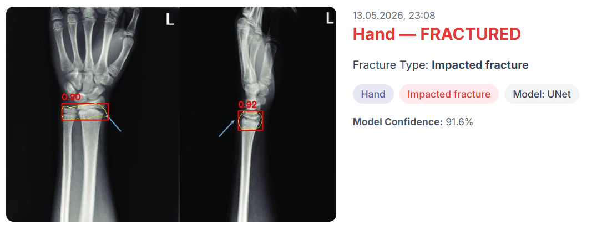
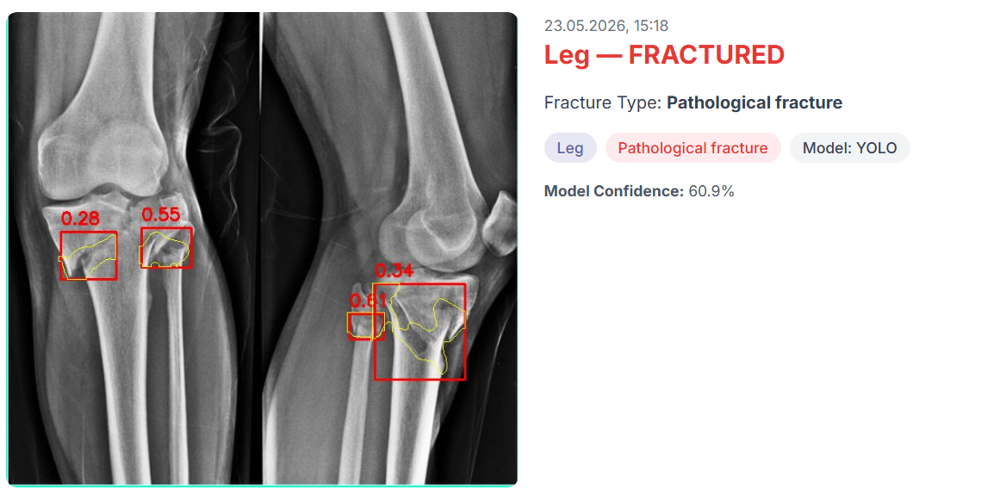
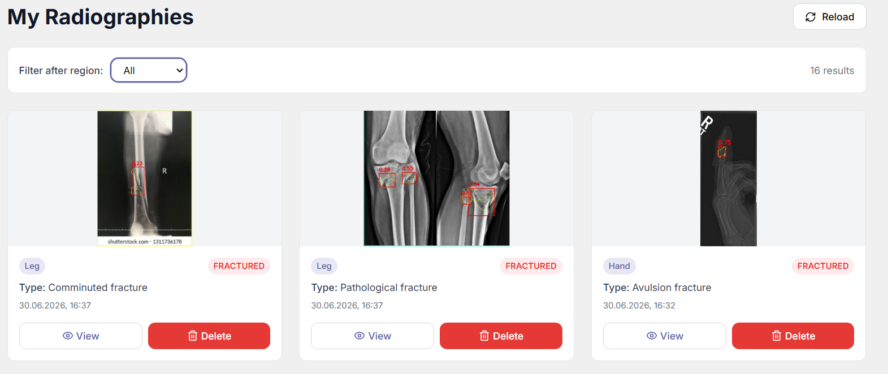
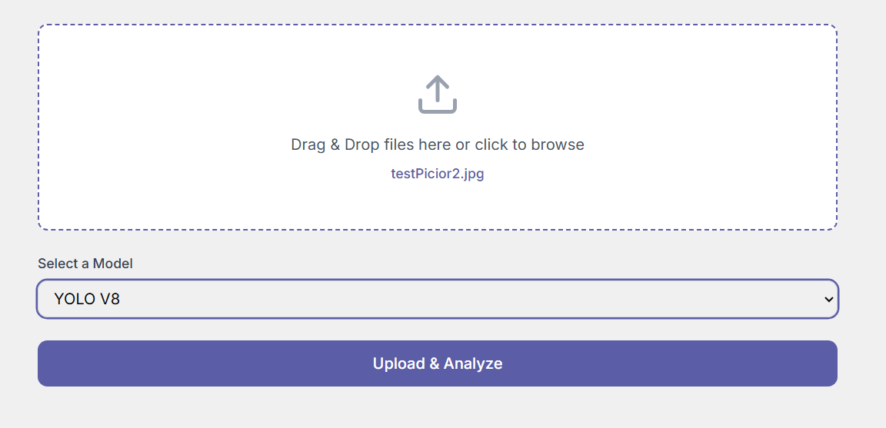

# FractureScope

**An end-to-end AI diagnostic system for automated bone fracture detection, segmentation, and classification in X-ray images.**

Diploma project — Technical University of Cluj-Napoca, Faculty of Automation and Computer Science
Results published as a paper presented at the **Computer Science Students Conference 2026**

---

## The Problem

Bone fractures are among the most common medical emergencies worldwide. Diagnosis relies mainly on X-ray imaging, but manual interpretation is slow and depends heavily on the physician's experience. In emergency settings, the rate of missed or misdiagnosed fractures can reach **20–30%** — a gap that motivates the need for a fast, reliable automated support tool.

Most existing research tackles a single isolated task — either detection *or* classification. **FractureScope** unifies the entire diagnostic pipeline: starting from one X-ray image, the system determines the anatomical region, detects and segments the fracture, filters out false positives, and classifies the fracture's morphological type — all through a single web application, running in real time on a standard CPU.

---

## How It Works

Five sequential modules, one complete diagnosis:

  

1. **Anatomical Classifier** — identifies the body region (hand, leg, hip, shoulder) before any further analysis.
2. **Segmentation** — the user picks between two complementary architectures:
   - **U-Net** — high sensitivity, catches nearly every fracture. Best for screening.
   - **YOLOv8m-seg** — faster and more precise. Best when reducing false alarms matters most.
3. **False-Alarm Filter** — a Random Forest classifier built on classical texture descriptors (GLCM, LBP, Hu Moments, edge density) rejects false positives caused by overlapping bones near joints.
4. **Morphological Classifier** — categorizes the confirmed fracture into one of ten clinical types (avulsion, comminuted, greenstick, spiral, etc.).
5. **Web Application** — displays the region, verdict, segmentation mask, and fracture type on a single screen, in under one second, with no dedicated GPU.
---

## Results

Trained and validated on [FracAtlas](https://www.nature.com/articles/s41597-023-02432-4) (4,083 X-rays, 4 anatomical regions) and [Bone Break Classification](https://www.kaggle.com/datasets/pkdarabi/bone-break-classification-image-dataset) (10 morphological classes).

| Module | Architecture | Metric | Value |
|---|---|---|---|
| Anatomical classifier | EfficientNet-B2 | Accuracy | **99.46%** |
| False-alarm filter | Random Forest | Accuracy | **95.12%** |
| Morphological classifier | EfficientNet-B2 (10 classes) | Accuracy | **78.55%** |
| Full system | End-to-end | Inference time | **< 1 second** (CPU) |

Compared against the official FracAtlas baseline — same test set, same metrics:

| Model | Recall | Precision | F1 | mAP@50 |
|---|---|---|---|---|
| YOLOv8s-seg (FracAtlas baseline) | 49.90% | 80.70% | – | 58.90% |
| **U-Net + Random Forest (proposed)** | **91.80%** | **99.00%** | **95.73%** | – |
| YOLOv8m-seg + Random Forest (proposed) | 62.30% | 88.37% | 73.08% | 54.10% |

The baseline model catches roughly half of all fractures. The proposed U-Net pipeline misses only 5 out of 61 — a **+41.9 percentage point** improvement in recall, the metric that matters most clinically.

---

## Tech Stack

| Layer | Technologies |
|---|---|
| **Frontend** | React, TypeScript |
| **Backend** | Java, Spring Boot, Spring Security, JWT |
| **ML Service** | Python, FastAPI, PyTorch, Ultralytics (YOLO), segmentation-models-pytorch, scikit-learn |
| **Database** | PostgreSQL |
| **Training environment** | Google Colab, Tesla T4 GPU |

The application runs as three separate services: a React frontend, a Spring Boot backend handling auth and persistence, and a Python/FastAPI service that keeps all five ML models in memory for inference.

---

## Screenshots

<table>
<tr>
<td>

 
Fracture detected — region, mask, and type
</td>

<td>

 
Fracture detected — region, mask, and type
</td>
</tr>

<tr>
<td>

 
More X-Rays
</td>

<td>

 
Uploading an X-ray for analysis
</td>
</tr>
</table>

---

## Key Contributions

- **Unified multi-task pipeline** — anatomical classification, detection, segmentation, false-alarm filtering, and morphological typing, combined for the first time on FracAtlas.
- **Comparative segmentation study** — U-Net and YOLOv8m-seg evaluated on the same test set with the same metrics, highlighting their complementary sensitivity/precision trade-off.
- **Texture-based validation classifier** — a Random Forest model using classical descriptors (GLCM, LBP, Hu Moments) to suppress false positives from overlapping bone structures, offering an interpretable alternative to a purely neural approach.
- **State-of-the-art results on FracAtlas** — the proposed system outperforms the published baseline on every comparable metric while running in real time on a standard CPU.

---

## Future Work

- Improve recognition of subtle fracture types (e.g., impacted, spiral) with larger, more balanced datasets
- Add morphological annotations directly to FracAtlas, enabling end-to-end training on a single dataset
- Extend the system to other anatomical regions and imaging modalities
- Integrate explainability, showing the reasoning behind each decision
- Clinical validation as a decision-support tool in emergency departments

---

## Author

**Adina-Ionela Jarda**

Coordinator: Conf. Dr. Ing. Raluca Didona Brehar

Technical University of Cluj-Napoca — Faculty of Automation and Computer Science, July 2026

adinajarda2@gmail.com · [LinkedIn](https://www.linkedin.com/in/adina-jarda-6908502a9/) · [GitHub](https://github.com/jardaadina)
